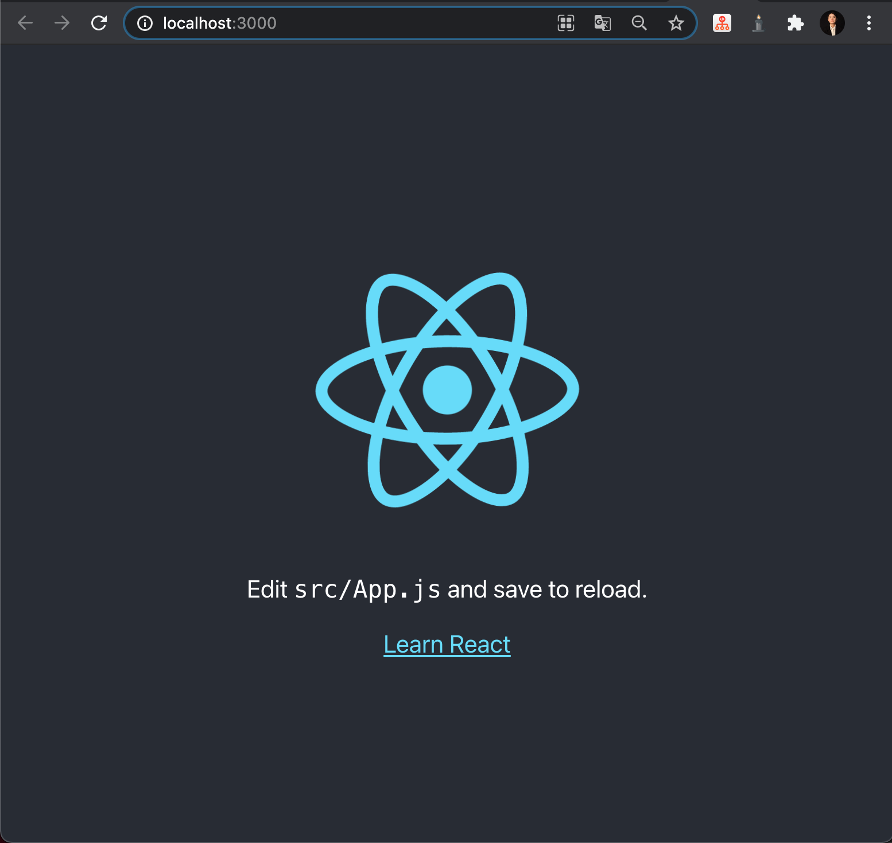
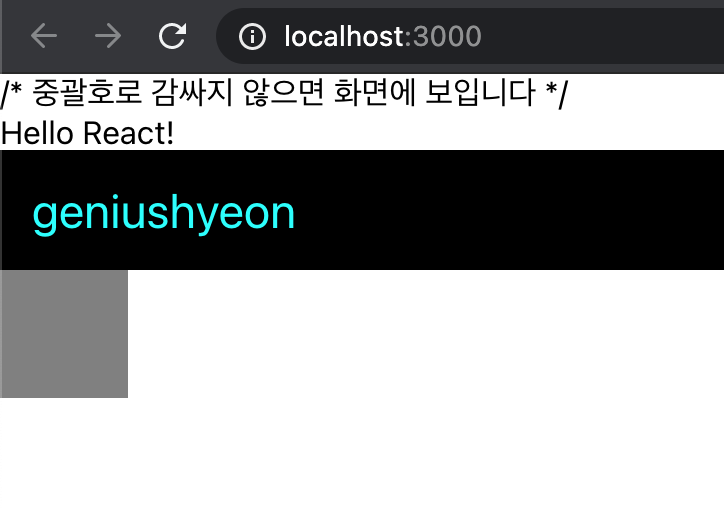
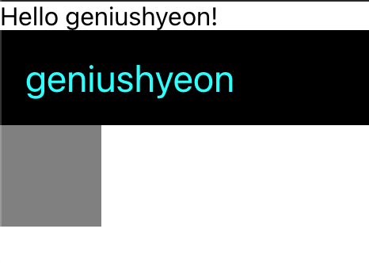
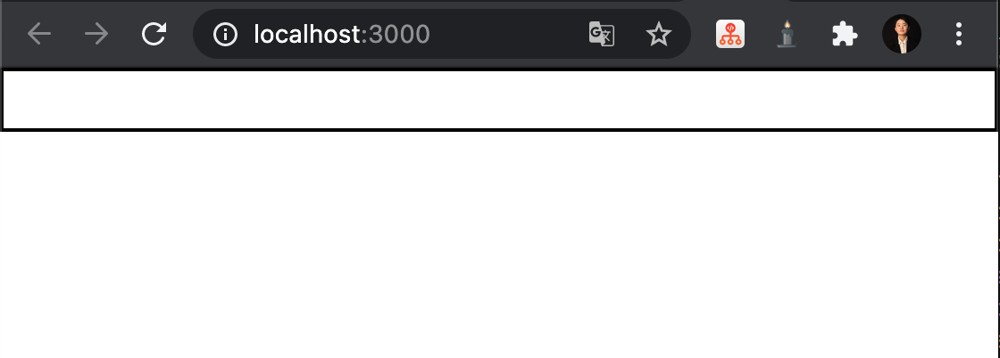
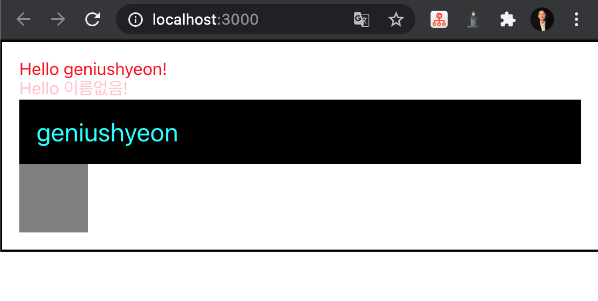

# 1. 리액트는 어쩌다가 만들어졌을까?
- 어떠한 상태가 바뀌었을 때, 그 상태에 따라 DOM을 어떻게 업데이트할지 규칙을 정하는게 아니라, `아예 다 날려버리고 처음부터 모든 걸 새로 만들어서 보여준다면 어떨까?`라는 아이디어에서 시작됨
- 리액트에서는 `Virtual DOM`이라는 것을 사용
  - 브라우저에서 실제로 보여지는 DOM이 아니라 `메모리에 가상으로 존재하는 DOM`으로써, just JavaScript Object이기 때문에 작동 성능이 훨씬 빠름
  - 상태가 업데이트되면, 업데이트가 필요한 곳의 UI를 Virtual DOM을 통해 렌더링함

# 2. 작업 환경 준비
## 2.1. Node.js 설치
```text
// node 설치
$ brew install node
// 버전 확인
$ node --version
$ npm --version
```
## 2.2. 프로젝트 생성
```text
$ npm install -g create-react-app
$ create-react-app react0410
```
- 생성하려고 하니
```text
You are running Node v11.0.0.
Create React App requires Node ^10.12.0 || >=12.0.0 or higher.
Please update your version of Node.
```
오류가 뜬다.. 업데이트해보자
## 2.3. node 업데이트하기
```text
$ brew update
$ brew upgrade node
$ npm install -g npm
```
## 2.4. 프로젝트 실행
```text
$ npm start
```
드디어 됐다!<br/>
<br/>

# 3. 나의 첫번째 리액트 컴포넌트
- 컴포넌트 만들기
```javascript
// 리액트 컴포넌트 만들기

// 리액트 불러오기
import React from 'react';

function Hello() {
    return <div>Hello React!</div>
}

// Hello라는 컴포넌트를 내보낼거야
export default Hello;
```
- App.js에서 Hello 컴포넌트 불러와서 사용하기
```jsx
import logo from './logo.svg';
import './App.css';

import React from 'react';
import Hello from './Hello';

function App() {
  return (
    <div>
      <Hello />
      // 재사용
      <Hello />
      <Hello />

    </div>
  );
}

export default App;
```
- index.js를 열어보면
```jsx
// 중략
import ReactDOM from 'react-dom';
// 중략
ReactDOM.render(<App />, document.getElementById('root'));
```
- 브라우저에 있는 실제 DOM 내부에 리액트 컴포넌트를 렌더링하겠다
  - 그러면 이 DOM이 어디에 있느냐?
- public/index.html 을 열어보면 내부에
```html
<div id="root"></div>
```
렌더링된 결과물이 위 div 내부에 렌더링됨

# 4. JSX
리액트에서 생김새를 정의할 때 사용하는 문법. 얼핏 보면 HTML같이 생겼지만 실제로는 JavaScript임
```jsx
return <div>Hello React!</div>;
```
## 4.1. 꼭 닫혀야 하는 태그
- HTML에서는 input 또는 br 태그를 사용할 때 닫지 않고 사용하기도 하지만, 리액트에서는 그렇게 하면 안됨!
- 태그와 태그 사이에 내용이 들어가지 않을 때는 `Self Closing 태그`라는 것을 사용해야 함
```html
<br/> <!-- Self Closing 태그 -->
```
## 4.2. 꼭 감싸져야하는 태그
- 두 개 이상의 태그는 무조건 하나의 태그로 감싸져있어야 함
```jsx
// 오류
return (
  <Hello />
  <div>goodbye</div>
);

// 정상
return (
  <div>
    <Hello />
    <div>goodbye</div>
  </div>
);
```
- 단순히 감싸기 위해 불필요한 div로 감싸는게 좋지 않을 경우, 리액트의 `Fragment` 사용
```jsx
// fragment
import logo from './logo.svg';
import './App.css';

import React from 'react';
import Hello from './Hello';

function App() {
  return (
    <>
      <Hello />
      <div>Goodbye</div>
    </>
  );
}

export default App;
```
- fragment는 브라우저 상에서 별도의 엘리먼트로 나타나지 않음

## 4.3. JSX 안에 자바스크립트 값 사용하기
- JSX 내부에 자바스크립트 변수를 보여줘야 할 때는 `{}`로 감싸서 보여줌
```jsx
import React from 'react';
import Hello from './Hello';

function App() {
  const name = 'geniushyeon';
  return (
    <>
      <Hello />
      <div>{name}</div>
    </>
  );
}
```
- 실행 결과
```text
Hello React!
geniushyeon
```
### 4.4. style과 className
- 인라인 스타일: 객체 형태로 작성하기
- baekground-color -> `backgroundColor`(camelCase)
```javascript
import logo from './logo.svg';
import './App.css';

import React from 'react';
import Hello from './Hello';

function App() {
  const name = 'geniushyeon';
  const style = {
    backgroundColor: 'black',
    color: 'aqua',
    fontSize: 24, // 기본 단위 px
    padding: '1rem' // 다른 단위 사용 시 문자열로 설정
  }
  return (
    <>
      <Hello />
      <div style={style}>{name}</div>
    </>
  );
}

export default App;

```
- CSS class 설정: `className = 클래스이름`
```jsx
<div className="gray-box"></div>
```

## 4.5. 주석
- `{/* jsx 주석 */}`

```jsx
import logo from './logo.svg';
import './App.css';

import React from 'react';
import Hello from './Hello';

function App() {
  const name = 'geniushyeon';
  const style = {
    backgroundColor: 'black',
    color: 'aqua',
    fontSize: 24, // 기본 단위 px
    padding: '1rem' // 다른 단위 사용 시 문자열로 설정
  }
  return (
    <>
    {/* 주석은 화면에 보이지 않습니다 */}
    /* 중괄호로 감싸지 않으면 화면에 보입니다 */
      <Hello 
      // 이렇게 주석 작성 가능
      />
      <div style={style}>{name}</div>
      <div className="gray-box"></div>
    </>
  );
}

export default App;

```
- 실행 결과<br/>

- 열리는 태그 내부에서는 `// 이런 형태로도 쓸 수 있다!`

# 5. props를 통해 컴포넌트에게 값 전달하기
- properties의 줄임말
- 어떠한 값을 컴포넌트에게 전달해줘야 할 때 사용

## 5.1. props의 기본 사용법
App 컴포넌트에서 Hello 컴포넌트를 사용할 때 'name'이라는 값을 전달해주고 싶으면, 이렇게 작성하자
- App.js
```jsx
// 중략
<Hello name="geniushyeon"/>
// 하략
```
- Hello.js
```jsx
import React from 'react';

function Hello(props) {
    return <div>Hello {props.name}!</div>
}

export default Hello;
```
- 실행 결과<br/>

- props는 `객체 형태`로 전달되고, name 값을 조회하고 싶다면 `props.name`으로 조회

## 5.2. 여러 개의 props, 비구조화 할당
### 비구조화 할당이란?
> '객체 구조 분해'라고 부르기도 한다.
```javascript
const ironMan = {
  name: '토니 스타크',
  actor: '로버트 다우니 주니어',
  alias: '아이언맨'
};

const captainAmerica = {
  name: '스티븐 로저스',
  actor: '크리스 에반스',
  alias: '캡틴 아메리카'
};

function print(hero) {
  const { alias, name, actor } = hero; // 객체에서 값들을 추출하여 새로운 상수로 선언
  const text = `${alias}(${name}) 역할을 맡은 배우는 ${actor} 입니다.`;
  console.log(text);
}

print(ironMan);
print(captainAmerica);
```
- 파라미터 단계에서 객체 비구조화 할당하기
```javascript
function print2({ alias, name, actor }) {
    const text = `${alias}(${name}) 역할을 맡은 배우는 ${actor} 입니다.`; // 템플릿 리터럴
    console.log(text);
  }
  
  print2(ironMan);
  print2(captainAmerica);
```
#### 비구조화 할당 시 기본값 설정
```javascript
const object = { a: 1 };

function print({ a, b = 2 }) {
  console.log(a);
  console.log(b);
}

print(object);
// 1
// 2
```
### 비구조화 할당 활용
```javascript
import React from 'react';

function Hello({color, name}) {
    return <div style={{color}}>Hello {name}!</div>
}

export default Hello;
```
## 5.3. defaultProps로 기본값 설정
```jsx
// Hello.js
Hello.defaultProps = {
    name: '이름없음'
}

// App.js
import logo from './logo.svg';
import './App.css';

import React from 'react';
import Hello from './Hello';

function App() {
  const name = 'geniushyeon';
  const style = {
    backgroundColor: 'black',
    color: 'aqua',
    fontSize: 24, // 기본 단위 px
    padding: '1rem' // 다른 단위 사용 시 문자열로 설정
  }
  return (
    <>
    
      <Hello name="geniushyeon" color="red"/>
      <Hello color="pink"/>
      <div style={style}>{name}</div>
      <div className="gray-box"></div>
    </>
  );
}

export default App;
```
- 실행 결과<br/>


## 5.4. props.children
- Wrapper.js를 만들자
```jsx
import React from 'react';

function Wrapper({children}) {
  const style = {
    border: '2px solid black',
    padding: '16px',
  };
  return (
    <div style={style}>

    </div>
  )
}

export default Wrapper;
```
- 이걸 App.js에서 쓰면
```jsx
import logo from './logo.svg';
import './App.css';

import React from 'react';
import Hello from './Hello';
import Wrapper from './Wrapper';

function App() {
  const name = 'geniushyeon';
  const style = {
    backgroundColor: 'black',
    color: 'aqua',
    fontSize: 24, // 기본 단위 px
    padding: '1rem' // 다른 단위 사용 시 문자열로 설정
  }
  return (
    <>
    <Wrapper>
      <Hello name="geniushyeon" color="red"/>
      <Hello color="pink"/>
      <div style={style}>{name}</div>
      <div className="gray-box"></div>
    </Wrapper>
    </>
  );
}

export default App;
```
- 실행을 해보면.. 가려짐<br/>

- Wrapper.js를 수정해주자
```jsx
import React from 'react';

function Wrapper({children}) {
  const style = {
    border: '2px solid black',
    padding: '16px',
  };
  return (
    <div style={style}>
        {children}
    </div>
  )
}

export default Wrapper;
```
- 실행 결과<br/>
<br/>
잘 나타남.
