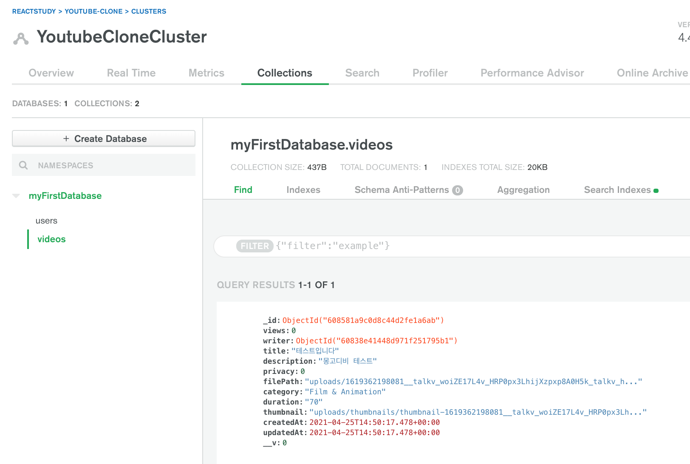

# 1. ffmpeg로 썸네일 생성하기
```sh
$ brew install ffmpeg
```
- 계속 파이썬 3.9 어쩌고 저쩌고 하면서 에러가 나서 구글링을 해봐도 해결 방법이 안 나오고, 한동안 멘붕이었는데 쉘에서 시키는 대로 했더니 설치가 완료됐다. xcode-select 어쩌구 명령어를 입력해서 설치했었던 것 같다. 메모를 해뒀어야 했는데 쏜살같이 지나가버림..
- install이 끝나면 프로젝트 루트 디렉토리에서 `fluent-ffmpeg`를 설치해준다.
```sh
$ npm install fluent-ffmpeg --save 
```
# 2. 비디오 업로드하기
## 2.1. mongoDB 용어 정리
|RDBMS|mongoDB|
|----|---|
|Database|Database|
|Tables|Collections|
|Rows|Documents|
|Columns|Fields|

## 2.2. model 만들고 DB에 저장하는 코드
- Video.js
```js
const mongoose = require('mongoose');
const Schema = mongoose.Schema;

const videoSchema = mongoose.Schema({
  // 필드 정의
  writer: {
    type: mongoose.Schema.Types.ObjectId, // Id만 넣어도 User에 가서 해당 User의 모든 정보를 불러옴
    ref: 'User'
  },
  title: {
    type: String,
    maxLength: 50
  },
  description: {
    type: String
  },
  privacy: {
    type: Number
  },
  filePath: {
    type: String
  },
  category: {
    type: String
  },
  views: {
    type: Number,
    default: 0
  },
  duration: {
    type: String
  },
  thumbnail: {
    type: String
  }
}, { timestamps: true });

const Video = mongoose.model('Video', videoSchema);

module.exports = { Video }
```
비슷한 듯 다르다.
- DB에 저장하는 코드(routes/video.js)
```js
router.post('/uploadVideo', (req, res) => {
    // 비디오 정보들을 mongoDB에 저장한다.
    const video = new Video(req.body); // client에서 보낸 모든 variables가 req.body에 담김

    video.save((err, doc) => {
      if (err) {
        return res.json({ success:  false, err })
      }
      res.status(200).json({ success: true });
    });
})
```
얘도 비슷한 듯 다르다. 간단해 보이긴 한데 얕게 배워서 그럴 듯..
## 2.3. mongoDB에 어떻게 저장되는지 확인해보자
cloud.mongodb 사이트에서 사용 중인 클러스터 선택 - Collections 탭 선택<br/>
<br/>
RDBMS만 보다가 처음으로 NoSQL 보니 넘모 신기..
